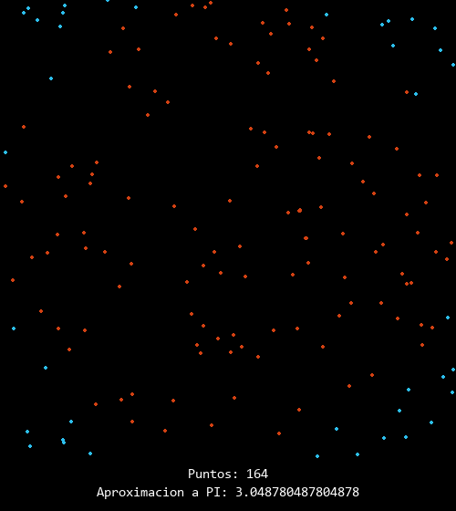

# Calculo aproximado de PI mediante el Metodo de Montecarlo

El metodo de Montecarlo es un metodo estadistico no determinista, se usa para estimar valores de expresiones matematicas complejas.

En este metodo se combinan la probabilidad y la estadistica mediante una simulacion o experimento de generacion de muestras aleatoreas.

Para calcular la aproximacion aPI mediante este metodo se tiene un cuadrado y dentro de ese cuadrado un circulo de diametro igual a sus lados, se generan puntos con coordenadas (x, y) de forma aleatorea y que esten dentro de ese cuadrado, teniendo en cuenta que entre mas puntos se generen su cantidad se aproximara a las areas, por lo tanto se asume que con una cantidad significativa de puntos, las areas seran mas precisas; las areas serian las del cuadrado y la del circulo, teniendo en cuenta que la cantidad de puntos dentro del circulo tambien pertenecen a la del cuadrado.

Por lo tanto si se tienen las ecuaciones de calculo de areas de un circulo y un cuadrado se tendria que:

#### Area del circulo
$$A=\Pi r^{2}$$

#### Area del cuadrado
$$Ac=l^{2}$$

sin embargo para expresarlo en funcion del radio del circulo, se puede decir que:
$$Ac=l^{2}=4r^{2}$$

Con las dos ecuaciones anteriores se puede decir que:
$$\frac{A}{Ac}=\frac{\Pi r^{2}}{4r^{2}}$$

Dado que se quiere averiguar $\Pi$ se despeja, con lo que se tiene:
$$\Pi=4\times \frac{A}{Ac}$$

O que dada la explicacion anterior se puede expresar de la siguiente forma:
$$\Pi=4\times \frac{Cantidad de puntos dentro del circulo}{Cantidad de puntos dentro del cuadrado}$$

Una muestra del funcionamiento con la siguiente animacion que representa de forma muy resumida la simulacion se veria asi:

Para generar un pantallazo del programa se presiona enter y ya.

Dada la naturaleza de aletoriedad del experimento algunas veces se acerca mas que otras, cada experimento tiende a dar resultados diferentes, sin emabargo parece que siempre da hasta 1 decimal correcto (3,1)

Feliz dia de $\Pi$ (2022 - **3 - 14**)
